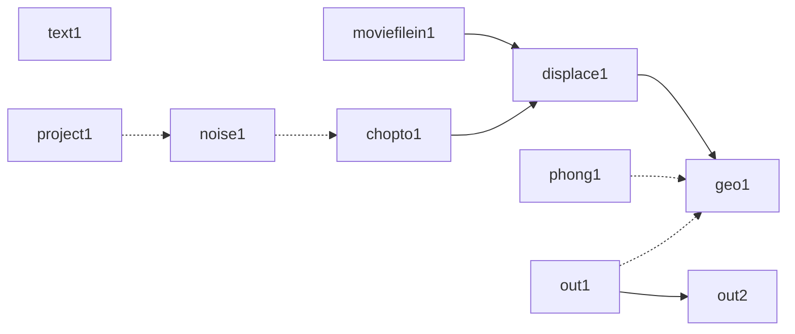

# network_to_diagram
By following the steps below, you can convert a network in TouchDesigner into a diagram in Mermaid.

## Setting
Open your network:


Put a *Text DAT* on your network:


Select *Python* as the Content Language in the Text DAT:


Click the *Edit* button and paste the network_to_diagram.py script into the Text DAT:


Update the `network_path`:

```
network_path = '/path/to/your/network'
```

## Conversion
Run the Text DAT and you will find a Mermaid diagram definition at Textport:
```
python >>> 
graph LR
    geo1[geo1]
    out2[out2]
    text1[text1]
    noise1[noise1]
    chopto1[chopto1]
    displace1[displace1]
    moviefilein1[moviefilein1]
    displace1 --> geo1
    phong1 -.-> geo1
    out1 -.-> geo1
    out1 --> out2
    project1 -.-> noise1
    noise1 -.-> chopto1
    moviefilein1 --> displace1
    chopto1 --> displace1
```

## Result
network in TouchDesigner:


diagram in Mermaid:
